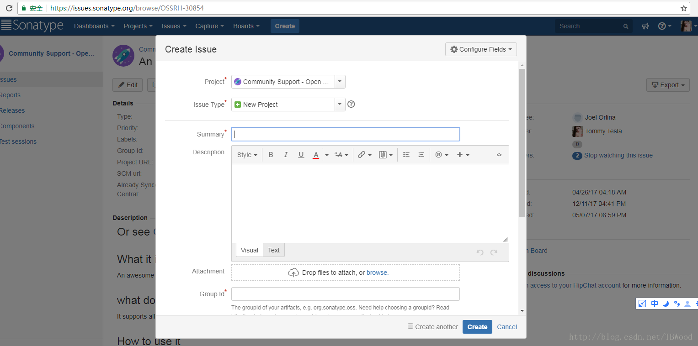
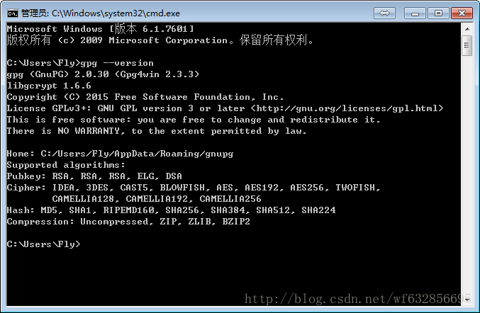
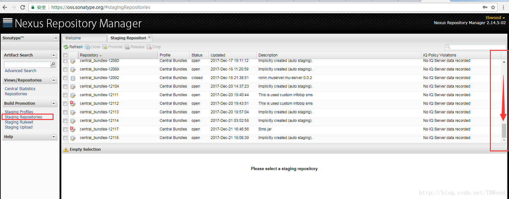

## 摘要

网上相关的教程很多，今天突然想起来写这么一篇，目的是想总结下在某台电脑全新安装遇到的问题，这些问题没有在网上已有教程中给出（正常情况下也不会遇到）。相信其他人也会遇到，也是怕自己会忘记，好记性不如烂笔头，所以决定写下来 :)
> 此教程仅适用于Windows操作系统

## 详细步骤

### 1. 创建一个[Sonatype](https://issues.sonatype.org)网站的帐号。

   创建好后记录下用户名密码，后面会用到~

### 2. 创建一个ISSUE，填写好项目信息，通知审核人员进行审核。
 

>注意groupId不能随便填，比如 org.xxx，需要保证你是xxx.org域名的拥有者。
    
### 3. 审核人员会进行信息确认，通过后会显示如下告知。


### 4. 安装GPG文件加密工具。[Windows点击下载](https://www.gpg4win.org/download.html)
安装好后，打开CMD界面，输入```gpg --version```，成功的情况下会显示软件版本。如下图：

  >这里需要说明的是GPG跟整个部署过程是完全独立的，GPG的工作原理很简单： 生成一对密钥，即**公钥**和**私钥**，其中**公钥（公钥键和公钥值）**会被发送到一个公开的第三方服务器上，然后使用私钥对文件加密，对方客户拿到二进制流和**公钥键**后，根据**公钥键**去第三方服务器获取这个公钥就可以解密文件了。

生成公钥私钥，输入```gpg --gen-key```，具体参考：
```
$ gpg --gen-key
gpg (GnuPG) 1.4.19; Copyright (C) 2015 Free Software Foundation, Inc.
This is free software: you are free to change and redistribute it.
There is NO WARRANTY, to the extent permitted by law.

Please select what kind of key you want:
   (1) RSA and RSA (default)
   (2) DSA and Elgamal
   (3) DSA (sign only)
   (4) RSA (sign only)
Your selection?
RSA keys may be between 1024 and 4096 bits long.
What keysize do you want? (2048)
Requested keysize is 2048 bits
Please specify how long the key should be valid.
         0 = key does not expire
      <n>  = key expires in n days
      <n>w = key expires in n weeks
      <n>m = key expires in n months
      <n>y = key expires in n years
Key is valid for? (0)
Key does not expire at all
Is this correct? (y/N) Y

You need a user ID to identify your key; the software constructs the user ID
from the Real Name, Comment and Email Address in this form:
    "Heinrich Heine (Der Dichter) <heinrichh@duesseldorf.de>"

Real name: tbwork
Email address: tangbo@lechebang.com
Comment: hello gpg
You selected this USER-ID:
    "tbwork(hello gpg) <tangbo@lechebang.com>"

Change (N)ame, (C)omment, (E)mail or (O)kay/(Q)uit? O
You need a Passphrase to protect your secret key.

We need to generate a lot of random bytes. It is a good idea to perform
some other action (type on the keyboard, move the mouse, utilize the
disks) during the prime generation; this gives the random number
generator a better chance to gain enough entropy.
+++++
.+++++
gpg: /c/Users/pc/.gnupg/trustdb.gpg: trustdb created
gpg: key XXXXXX marked as ultimately trusted
public and secret key created and signed.

gpg: checking the trustdb
gpg: 3 marginal(s) needed, 1 complete(s) needed, PGP trust model
gpg: depth: 0  valid:   1  signed:   0  trust: 0-, 0q, 0n, 0m, 0f, 1u
pub   2048R/XXXXXX 2017-12-19
      Key fingerprint = DB61 9873 924C 020E 20E7  E461 0170 C912 B15C 5AA3
uid                  tbwork(hello gpg) <tangbo@lechebang.com>
sub   2048R/YYYYYY 2017-12-19
```
其中XXXXX就是**公钥键**，然后把这个公钥发布到第三方服务器上：
```
gpg --keyserver hkp://keyserver.ubuntu.com:11371 --send-keys XXXXXX
```
> 2018/3/21 追加注意点：最新的通过Gpg4win下载的gpg版本为2.2.4,该版本使用的RSA2048，生成公钥秘钥时只会展示一个长串的公钥，私钥不会显示。

Maven在使用GPG插件的时候需要GPG代理处于运行状态，通过以下命令可以开启：
```
gpg-agent --daemon
```
至此GPG相关的就算搞定了。

> 后来我在其他电脑上进行部署的过程中发现有时候会报错
> ```gpg: gpg-agent is not available in this session```
> 为了查明这个问题，我基于gpg插件源码怒写了一个有详细报错的gpg-maven插件（原版没有任何其他有用提示），最终发现是最新的gpg-maven使用的gpg要求是2.0版本。这台电脑装的也确实是2.0版本，问题出在这台电脑装过GIT for Windows，默认安装了gpg 1.4.21，并且添加到了系统变量中。解决方案简单，只需要把装有gpg 2.0的安装目录配置到系统变量**PATH**的最前面即可。

### 5. 项目POM配置
在项目的pom.xml中添加以下配置项：
```
<project xmlns="http://maven.apache.org/POM/4.0.0" xmlns:xsi="http://www.w3.org/2001/XMLSchema-instance"
  xsi:schemaLocation="http://maven.apache.org/POM/4.0.0 http://maven.apache.org/xsd/maven-4.0.0.xsd">
  <modelVersion>4.0.0</modelVersion>

  <parent>
      <groupId>org.sonatype.oss</groupId>
      <artifactId>oss-parent</artifactId>
      <version>7</version>
  </parent>

  <groupId>org.tbwork.anole</groupId>
  <artifactId>anole-loader</artifactId>
  <version>1.1.6</version>
  <packaging>jar</packaging>

  <name>anole-loader</name>
  <url>https://github.com/tbwork/anole-loader</url>
  <description>An awesome property or configuration loader for java.</description> 
  <properties>
    ...
  </properties>
   
  <licenses>
	  <license>
	        <name>The Apache License, Version 2.0</name>
	        <url>http://www.apache.org/licenses/LICENSE-2.0.txt</url>
	  </license>
  </licenses>
  <developers>
	  <developer>
	        <name>tbwork</name>
	        <email>542561232@qq.com</email>
	        <roles>
	            <role>owner</role>
	        </roles>
	        <timezone>+8</timezone>
	 	</developer>
  </developers>
  <scm>
	    <connection>scm:git:https://github.com/tbwork/anole-loader.git</connection>
	    <developerConnection>scm:git:https://github.com/tbwork/anole-loader.git</developerConnection>
	    <url>https://github.com/tbwork/anole-loader</url>
	    <tag>v${project.version}</tag>
  </scm>

  <dependencies>
   ...
  </dependencies>
  
  <build>  
    <plugins>   
        ...
		<plugin>
			<groupId>org.apache.maven.plugins</groupId>
			<artifactId>maven-javadoc-plugin</artifactId>
			<version>2.9.1</version>
			<executions>
				<execution>
					<phase>package</phase>
					<goals>
						<goal>jar</goal>
					</goals>
				</execution>
			</executions>
		</plugin>
		<plugin>
			<groupId>org.apache.maven.plugins</groupId>
			<artifactId>maven-gpg-plugin</artifactId>
			<version>1.6</version>
			<executions>
				<execution>
				    <id>sign-artifacts</id>
					<phase>verify</phase>
					<goals>
						<goal>sign</goal>
					</goals>
				</execution>
			</executions>
		</plugin>
    </plugins>    
  </build>
  <distributionManagement>
		<snapshotRepository>
			<id>tb_oss</id>
			<url>https://oss.sonatype.org/content/repositories/snapshots</url>
		</snapshotRepository>
		<repository>
			<id>tb_oss</id>     <url>https://oss.sonatype.org/service/local/staging/deploy/maven2</url>
		</repository>
  </distributionManagement>
</project>
```
### 6. 修改setting.xml文件
相信每个maven用户都在```C:\Users\pc\.m2```目录下创建了setting.xml文件。如果没有可以百度下~
对setting.xml文件做以下配置：
```
<servers>
  <server>
    <id>sonatype-nexus-snapshots</id>
    <username>Sonatype网站的账号</username>
    <password>Sonatype网站的密码</password>
  </server>
  <server>
    <id>sonatype-nexus-staging</id>
    <username>Sonatype网站的账号</username>
    <password>Sonatype网站的密码</password>
  </server>
</servers>
```

### 7. 部署Jar包
通过简单的maven 部署命令```mvn clean deploy```即可，期间会弹出GPG的密码插件，只需要输入在第4步生成公钥私钥时自己设置的密码即可。
如果不希望每次都手动输入密码，可以使用以下更详细的部署命令：
```
mvn clean deploy -P sonatype-oss-release -Darguments="gpg.passphrase=设置gpg设置密钥时候输入的Passphrase"
```

### 8. 发布Jar包
点此登入[中央仓库Nexus管理后台](https://oss.sonatype.org/#stagingRepositories)，密码与sonatype的密码相同。
如下图点击左侧的```Stating Repositories```，右侧下拉到底，找到自己的包。


选中自己的包后，点击上方的```close```按钮（因为图中的包的已经发布完毕，所以这里看不到）。close后需要等待几分钟，刷新页面会发现`release`按钮点亮了，这时候点击release即可把我们的jar包发布到中央库了。发布成功后，可能暂时还无法在http://search.maven.org/中搜索到，需要等上几个小时，先安心做点其他事情把。
过个把星期，你的包就可以出现在http://mvnrepository.com/这些更加流行的maven仓库搜索站点上咯~（同步需要时间）

> 注：staging repository就是指等待登上舞台（发布给大家使用）的那些包，close是指完结部署请求，release自然就是发布了。

Be free to ask if you encounter any problem about it. 


* content
{:toc}